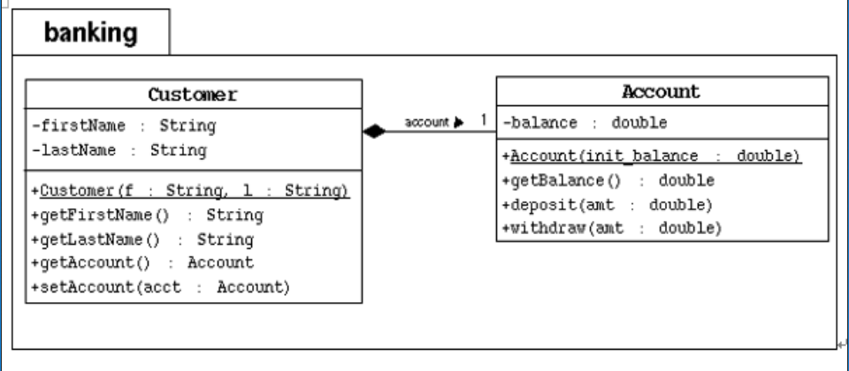

# Java

1. **OOP (Object Oriented Programing)**

    

    객체의 관계

    - 실 세계의 모든 것은 객체간의 상호작용에 의해 이루어진다는 개념
    - SW 시스템을 객체(Object) 단위로 구성되며, 객체들이 서로 관계성을 가지는 시스템
    - Abstraction(추상화)
        - 현상에 존재하는 객체 주요특징을 추출하는 과정
    - Encapsulation(캡슐화)
        - 하나의 클래스 안에 데이터와 기능을 담음
    - Inheritance(상속)
        - 객체 정의 시 기존에 존재하는 객체의 속성과 기능을 상속받아 정의
    - Polymorphism(다형성)
        - 같은 타입 또는 같은 기능의 호출로 다양한 효과를 가져오는 것

2. **Java SE 파일 경로**
    - `bin` : 컴파일러, 디버거, 실행파일이 들어있는 폴더
    - `src.zip` : Java API Source
    - `rt.jar` : 클래스 파일의 묶음

3. **Package**
    - java . lang . System
        - [FQCN(Fully Qualified Class Name)](https://www.notion.so/ffba74e7-04d4-49f0-b780-68332574a5e7)
        - lang (*package or directory*)
            - System (*class*)

        [Java Platform SE 8](https://docs.oracle.com/javase/8/docs/api/)

4. **Java Compile** 

    

    

5. Array(배열)
    - ***List of Same data type***
    - *Array can't resize*
    1. Stack array변수 할당
    2. Heap arr 변수 할당
    3. Heap 주소 할당
    4. Stack 주소 값에 Heap 주소 값 할당
    5. Stack의 주소 값으로 Heap 참조
6. 객체
    - 동일한 객체란?
        - 주소가 같은 객체
7. `Garbage Collector`
    - 하나의 Thread
    - 우선순위가 낮다.
    - `Static`으로 선언된 값은 `Heap` 공간 안에 들어가지 않는다.
        - 따라서 Garbage collector 검사 대상이 아니다.
8. 함수란 두가지 기능을 한다.
    - *Return*
    - *Call*
9. **SE 버전과 EE 버전**
    - 함수 호출의 대상이 바뀐다.
        - 기능이 늘어나면 모두 제어하기 힘들다.
10. **Call by value && Call by Reference**
    - 자바는 *Call by value*를 선택.
        - 파라미터 값으로 객체를 넘기면 그 객체의 주소가 넘어가
11. `This`
    - 필드명과 로컬변수의 이름이 같을때 구분하기 위해서 필드앞에 지정
        - 객체의 reference값을 가지고 있기 때문에
    - `this()`
        - 생성자 앞에 쓰이는 this
        - 하나의 클래스 내에서 또다른 생성자를 호출할때 사용
12. **의존성**

    

    - `Customer` 가 `Acoount`를 의존(*dependency*)한다.
- **정보를 저장하는 클래스**
    - *Domain (DO, Domain Object)*
    - *VO(Value Object)*
    - *DTO(Domain Transfer Object)*

### 수직적인 관계

---

소프트웨어는 수평적인 관계와, 수직적인 관계로 연결되어 있다.

- ***Hasing : 관계를 가지기 위해서 필드로 그 객체를 가져야한다.***

### 추상화(Abstract) && 일반화(Generalization) <—> *구체화(Specialization)*

---

공통적인 성질을 추출해서 그 성질을 일반적인 특성으로 가지는 모듈을 하나.

### `super();`

---

    public Manager(String name, double salary, MyDate birthDate, String dept) {
    //		super();	 부모 기본 생성자 호출
    		this.name = name;
    		this.salary = salary;
    		this.birthDate = birthDate;
    		this.dept = dept;
    	}

`super()`를 호출하지 않아도 자동으로 호출된다.

**상속 받은 클래스는 메모리에 올라갈때 부모클래스가 아니더라도 함께 메모리에 올라간다.** 

자식을 생산한다. → 부모가 만들어진다. 

### Method Overriding (메소드 재정의)

---

상속관계에 있는 두 클래스에서 적용되는 원리

- 부모가 가진 기능을 물려받고 그것을 자식이 다시 고쳐쓰는 것

### Rule

메소드 선언부는 모두 일치 (리턴타입, 이름, 인자값) → 접근 지정자

메소드 구현부는 반드시 달라야한다. (순서, 타입, 갯수중 하나라도 달라야한다.)

**More modifier / Less Exception**

*parent*

    public void eat(String kind, String num)
    void go()

*child*

    void eat(String kind, String num) //  x 
    public void eat(String kind, String num)
    public void go() {  // ok

### Object method

---

`Test t = new Test();`에서의 `new Test`는 **참조변수.**

**참조변수**뒤에는 `toString()`이 생략되어있다.

### 접근지정자 Access Modifier

---

public , protected , private 

protected는 상속이 되어있을때 public이 된다.

### `this` && `super` 사용법

---

1. **`super()`와 `this()`생성자는 함께 사용할 수 없다?**

    ### 해결

    - 생성자는 클래스의 생성시에 단 한번만 호출되며, 객체의 초기화를 담당한다.
    - `super()`는 항상 가장 첫줄에 제시되어있다. ( 명시하지 않았다면 생략되어있음 )

    ### IF

    - `this()`생성자 호출을 통해서 해당 생성자에서  다른 생성자로 이동하면 그곳에 super() 메소드가 생략되어 있다. 따라서, `super()` 생성자는 항상 가장 첫줄에 제시되어있다.

생성자는 메소드가 아니다!!

# Overroading

---

메소드 하는 일은 같고 처리하는 데이터를 달리할때 쓰이는 기법

### 조건

- 메서드의 **이름**이 같아야 한다.
- 메서드의 **리턴타입**이 다른 경우는 오버로딩이 성립되지 않는다.
- 매개변수의 개수 or 매개변수의 자료형이 달라야 한다.

### 참고자료

---

[생성자(Constructor)도 메소드인가?](https://javacan.tistory.com/entry/37)

# 상속(Polymorphism = Poly+Morphism)

---

하나의 객체변수가 여러개의 모습과 모양을 갖는 능력

부모타입의 변수로 다양한 자식객체를 생성하는 것

- Virtual Method Invocation 원리
- Object Casting
- [Instanceof](https://www.notion.so/d5914ea3-97d8-4c98-81a4-63b746c8a636)

# 리턴(Return)의 중요성

---

클라이언트의 요청 하나당 서버 사이드의 메소드로 응답한다.