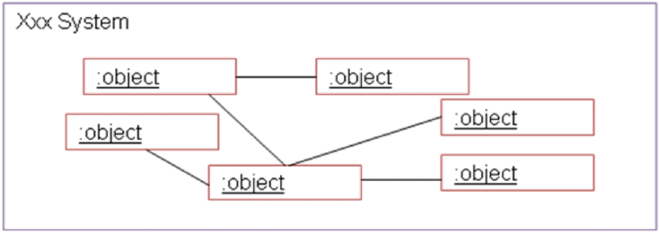
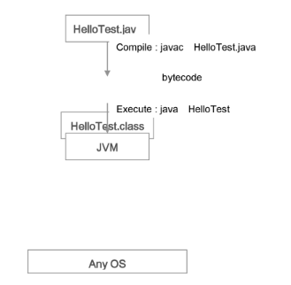

# Java

1. **OOP (Object Oriented Programing)**

    

    객체의 관계

    - 실 세계의 모든 것은 객체간의 상호작용에 의해 이루어진다는 개념
    - SW 시스템을 객체(Object) 단위로 구성되며, 객체들이 서로 관계성을 가지는 시스템
    - Abstraction(추상화)
        - 현상에 존재하는 객체 주요특징을 추출하는 과정
    - Encapsulation(캡슐화)
        - 하나의 클래스 안에 데이터와 기능을 담음
    - Inheritance(상속)
        - 객체 정의 시 기존에 존재하는 객체의 속성과 기능을 상속받아 정의
    - Polymorphism(다형성)
        - 같은 타입 또는 같은 기능의 호출로 다양한 효과를 가져오는 것

2. **Java SE 파일 경로**
    - `bin` : 컴파일러, 디버거, 실행파일이 들어있는 폴더
    - `src.zip` : Java API Source
    - `rt.jar` : 클래스 파일의 묶음

3. **Package**
    - java . lang . System
        - [FQCN(Fully Qualified Class Name)](https://www.notion.so/ffba74e7-04d4-49f0-b780-68332574a5e7)
        - lang (*package or directory*)
            - System (*class*)

        [Java Platform SE 8](https://docs.oracle.com/javase/8/docs/api/)

4. **Java Compile** 

    

    

5. Array(배열)
    - ***List of Same data type***
    - *Array can't resize*
    1. Stack array변수 할당
    2. Heap arr 변수 할당
    3. Heap 주소 할당
    4. Stack 주소 값에 Heap 주소 값 할당
    5. Stack의 주소 값으로 Heap 참조
6. 객체
    - 동일한 객체란?
        - 주소가 같은 객체
7. `Garbage Collector`
    - 하나의 Thread
    - 우선순위가 낮다.
    - `Static`으로 선언된 값은 `Heap` 공간 안에 들어가지 않는다.
        - 따라서 Garbage collector 검사 대상이 아니다.
8. 함수란 두가지 기능을 한다.
    - *Return*
    - *Call*
9. **SE 버전과 EE 버전**
    - 함수 호출의 대상이 바뀐다.
        - 기능이 늘어나면 모두 제어하기 힘들다.
10. **Call by value && Call by Reference**
    - 자바는 Call by value를 선택.
        - 파라미터 값으로 객체를 넘기면 그 객체의 주소가 넘어가
11. `This`
    - 필드명과 로컬변수의 이름이 같을때 구분하기 위해서 필드앞에 지정
        - 객체의 reference값을 가지고 있기 때문에
    - `this()`
        - 생성자 앞에 쓰이는 this
        - 하나의 클래스 내에서 또다른 생성자를 호출할때 사용
12. **의존성**

    

    - `Customer` 가 `Acoount`를 의존(*dependency*)한다.
- **정보를 저장하는 클래스**
    - *Domain (DO, Domain Object)*
    - *VO(Value Object)*
    - *DTO(Domain Transfer Object)*

### 수직적인 관계

---

소프트웨어는 수평적인 관계와, 수직적인 관계로 연결되어 있다.

- ***Hasing : 관계를 가지기 위해서 필드로 그 객체를 가져야한다.***

### 추상화(Abstract) && 일반화(Generalization) <—> *구체화(Specialization)*

---

공통적인 성질을 추출해서 그 성질을 일반적인 특성으로 가지는 모듈을 하나.